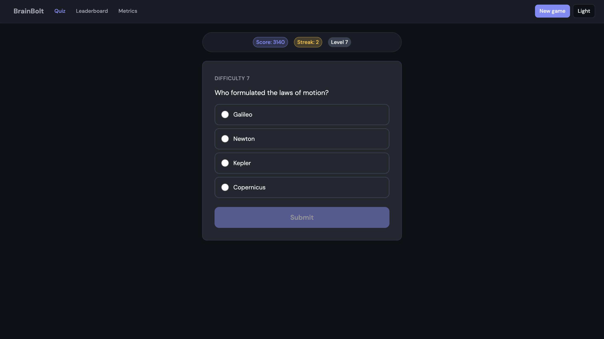
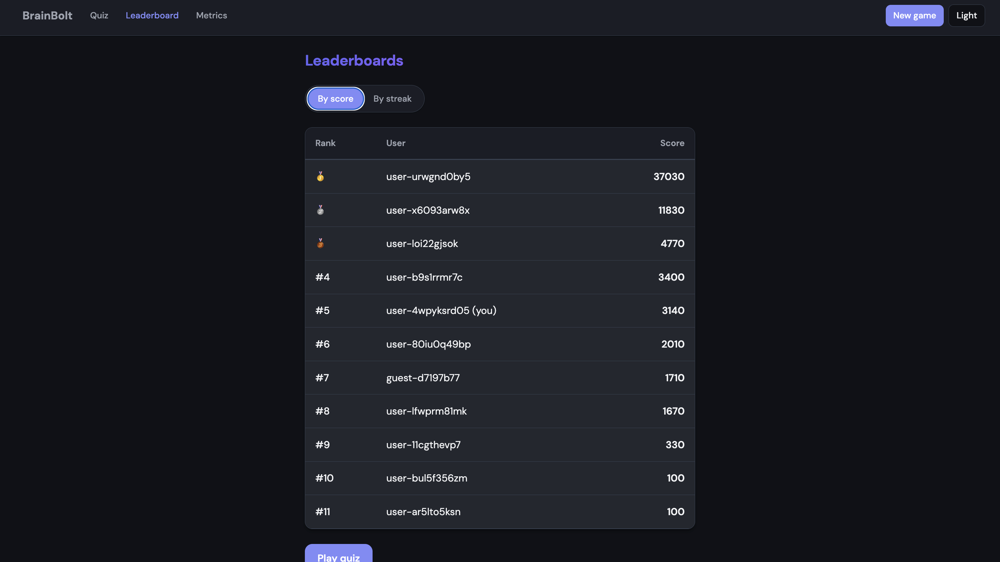
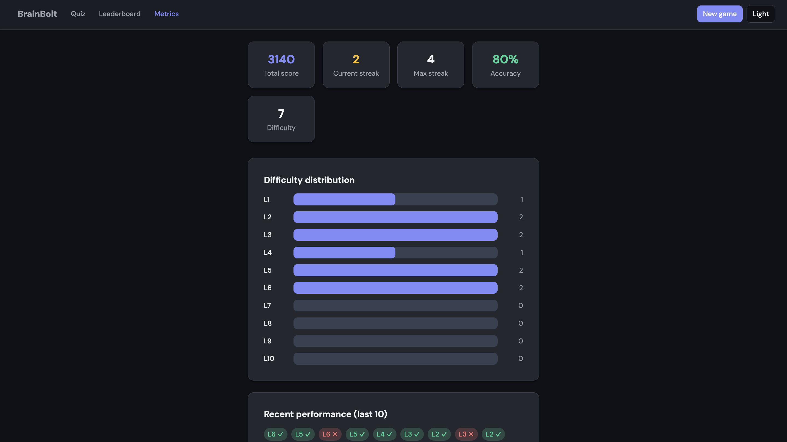

# BrainBolt

BrainBolt is an adaptive infinite quiz: one question at a time, with difficulty that increases on correct answers and decreases on incorrect ones. It includes live leaderboards (by score and by streak), per-user metrics, and session-based question selection so no question repeats in a single run.

---

## Screenshots








---

## Demo

**[Watch the demo video](https://drive.google.com/file/d/1VLkifutZShf72cHe9QT0fZ7GL8w_ocAQ/view?usp=sharing)**
---

## Getting started

**Prerequisites:** Docker and Docker Compose.

```bash
git clone https://github.com/sujalverma7557/BrainBolt.git
cd Brain-Bolt
docker compose up --build
```

The first run builds the app and seed image, starts PostgreSQL and Redis, seeds the database, and starts the web app. Open **http://localhost:3000** when the build completes.


---

## Features

- **Adaptive quiz** — One question per screen; difficulty (1–10) increases on a correct answer and decreases on an incorrect one. Scoring uses difficulty and streak-based multiplier (capped). Questions do not repeat within a session; when the current-difficulty pool is exhausted, questions are drawn from adjacent difficulties.
- **Leaderboards** — By total score and by maximum streak. Ranks are shown in the UI and returned in the answer API response.
- **Metrics** — Current difficulty, streak, max streak, total score, accuracy, and the last 10 answers with level and outcome.
- **New game** — Starts a new identity in the browser; the previous run remains on the leaderboard under its id.

The application ships with 135 seed questions across multiple difficulties and subjects. For API contracts, database schema, scoring, and edge-case handling, see **docs/LLD.md**.

---

## Tech stack

- **Frontend** — Next.js 14 (App Router), TypeScript, React
- **Backend** — Next.js API routes (`/api/v1`)
- **Database** — PostgreSQL 16, Drizzle ORM
- **Cache / session** — Redis (user state, question pools, rate limiting, session-asked set)
- **Runtime** — Docker Compose (Postgres, Redis, seed job, app on port 3000)

Local development is supported with a local PostgreSQL and Redis instance; copy `.env.example` to `apps/web/.env` and set `DATABASE_URL` and `REDIS_URL` accordingly.

---

## Project structure

- **apps/web/** — Next.js app: `app/` (routes, `api/v1/`), `lib/` (adaptive, score, quiz-service, db, redis, rate-limit), `components/`, `scripts/seed-questions.ts`
- **docs/** — Low-level design (`LLD.md`), screenshots (`screenshots/`)
- **Root** — `docker-compose.yml`, `.env.example`, root `package.json`

**API:** `GET /api/v1/quiz/next`, `POST /api/v1/quiz/answer`, `GET /api/v1/quiz/metrics`, `GET /api/v1/leaderboard/score`, `GET /api/v1/leaderboard/streak`. Schemas and behavior are documented in **docs/LLD.md**.
